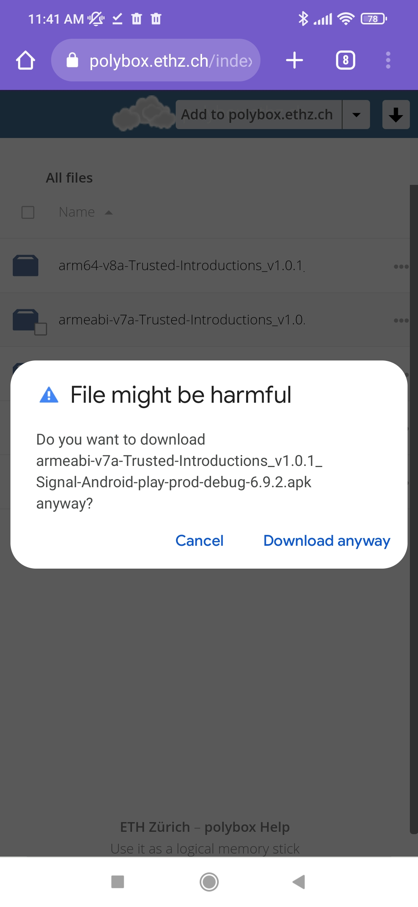
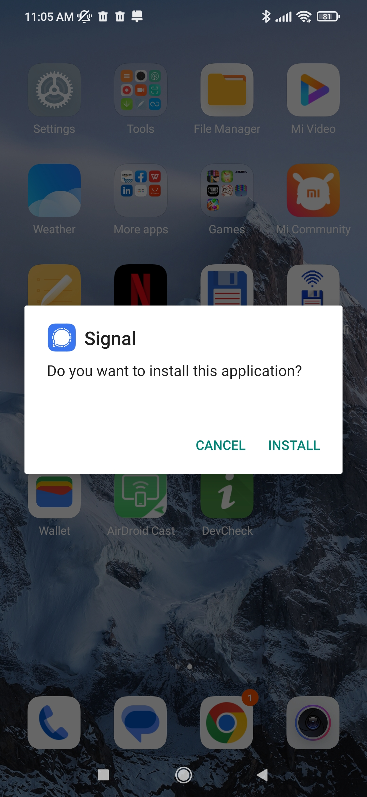
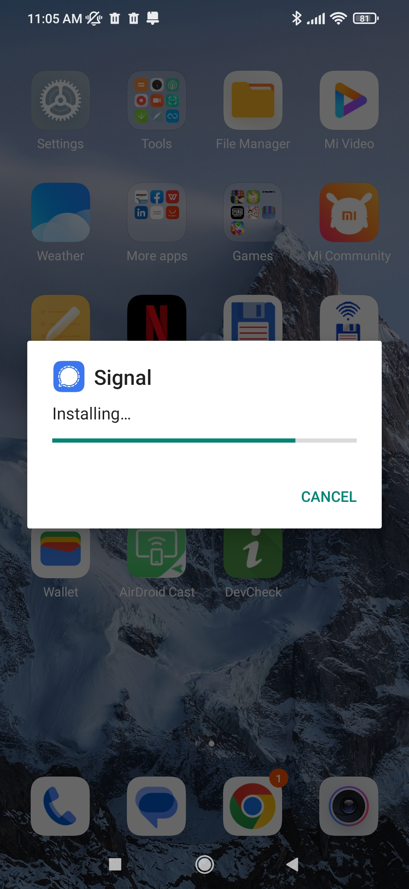
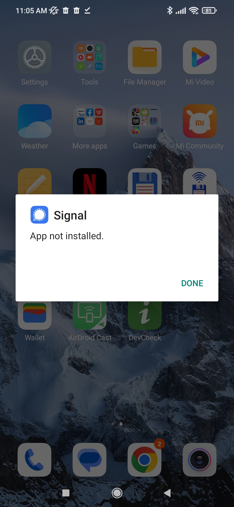

# Trusted Introductions for the Signal private messenger

Welcome!

This page is your point of entry for the research project building Trusted Introductions for the Signal private messenger.

This project is executed at the [Network Security group](https://netsec.ethz.ch/) of ETH Zürich and funded by the Werner Siemens Foundation through the [Centre for Cyber Trust](https://cyber-trust.org/).

If you would like to join the upcoming Android user study or have other questions about the project, feel free to get in touch with the [PI](https://people.inf.ethz.ch/cgloor) .

##  Table of contents
  - [Project Description](#project-description)
  - [Ressources](#ressources)
    - [Android Download](#android-download)
    - [HowTos](#howtos)
      - [Backup your Signal Data](#backup-your-signal-data)
      - [Install the modified application](#install-the-modified-application)
      - [Transfer your Signal Data](#transfer-your-signal-data)
      - [Move back to a normal installation of Signal](#move-back-to-a-normal-installation-of-signal)
    - [Source Code](#source-code)
      - [Android](#android)
      - [Telemetry Server](#telemetry-server)

## Project Description
TODO

## Ressources

### Android Download
You can download the newest APK for Android smartphones [here](https://polybox.ethz.ch/index.php/s/K9mgiDihWqj9dIC) . Your smartphone will warn you that the file may be harmful. This is because Android expects all applications to be downloaded via. the Google Play store. Since this is coming directly from us and not through the store, Google did not check the file for malicious code and hence you see the warning. It is safe to download the file anyway. 

#### **Which file is right for my phone?**

##### TLDR;

You can simply try to install the files in the following order:
1. _arm64_v8a_
2. _x86_64_
3. (if your phone is very old, _armeabi-v7a_ or _x86_)
4. if all else fails: _universal_, this should work with any phone but will use more storage

On if it fails, your phone will simply tell you that Signal could not be installed and you can move to the next file.

##### More information:

The correct file will depend on the processor type that is in your smartphone. The different names denote different _instruction sets_ that a processor might use. Most commonly, Android phones use the ARM CPU architecture, more rarely, you might find an x86 architecture. 
You can google for your processor and then find which CPU cores it contains.
The more direct way is through a third party app, as this information is not commonly listed in the native Android settings. For example, [DevCheck](https://play.google.com/store/apps/details?id=flar2.devcheck) easily exposes what kind of CPUs the processor contains. 
After finding the type of CPU, you will still need to google for the instruction set they use.

### HowTos
#### Backup your Signal Data
TODO

#### Install the modified application
TODO

#### Transfer your Signal Data
TODO

#### Move back to a normal installation of Signal

### Source Code
TODO

#### Android
TODO

#### Telemetry Server
TODO
