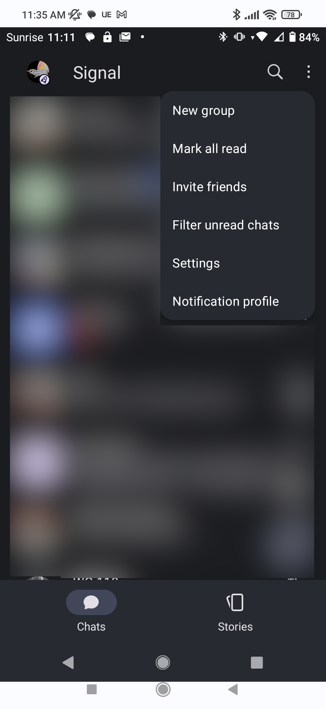
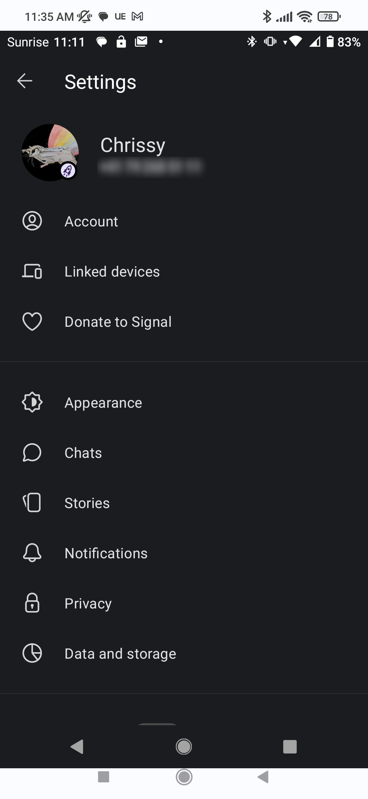
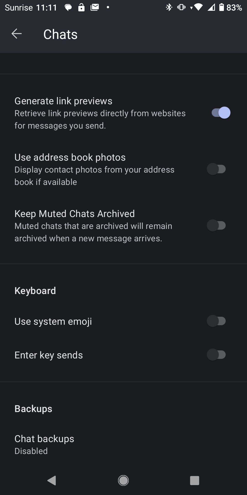
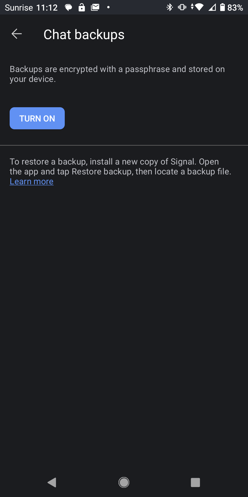
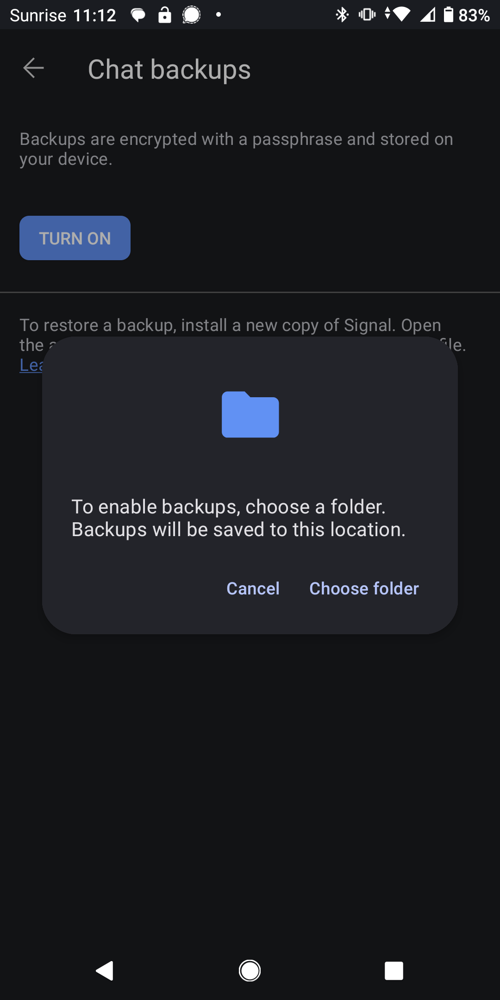
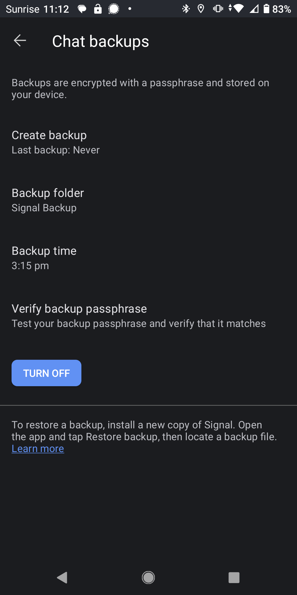
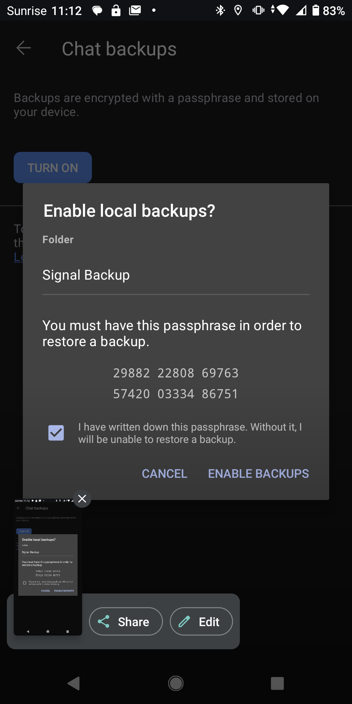
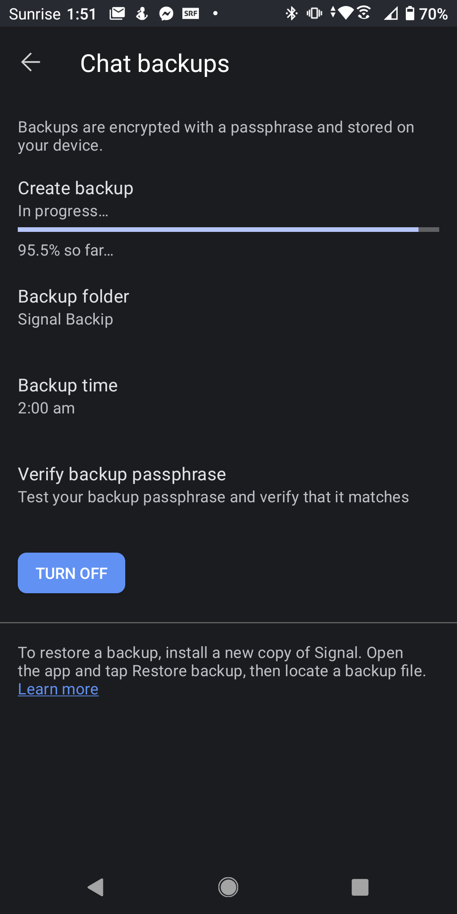

# Trusted Introductions for the Signal private messenger

Welcome!

This page is your point of entry for the research project building Trusted Introductions for the Signal private messenger.

This project is executed at the [Network Security group](https://netsec.ethz.ch/) of ETH Zürich and funded by the Werner Siemens Foundation through the [Centre for Cyber Trust](https://cyber-trust.org/).

If you would like to join the upcoming Android user study or have other questions about the project, feel free to get in touch with the [PI](https://people.inf.ethz.ch/cgloor) .

##  Table of contents
  - [Project Description](#project-description)
  - [Ressources](#ressources)
    - [Android Download](#android-download)
    - [HowTos](#howtos)
      - [Backup your Signal Data](#backup-your-signal-data)
      - [Install the modified application](#install-the-modified-application)
      - [Transfer your Signal Data](#transfer-your-signal-data)
      - [Move back to a normal installation of Signal](#move-back-to-a-normal-installation-of-signal)
    - [Source Code](#source-code)
      - [Android](#android)
      - [Telemetry Server](#telemetry-server)

## Project Description
TODO

## Ressources

### HowTos
#### **Backup your Signal Data**
Open Signal on your Android Smartphone and navigate to the settings, from there open the "Chats" setting.

|  |  |
| ------------- | ------------- |
|   |   |

From here, navigate to "Chat backups" and turn on backups. You will now be asked to choose a location on your smartphone for signal to store you backups in. Choose a folder and make sure to note which one it is. 

**Please be aware that you will need a significant amount of free storage on your smartphone if Signal is your main messaging application, since the backups will include all the media sent and received through the application. While testing we got backups that were a few GB in size. This will depend on the content of your chats. For example, your backup will be significantly larger if you send a lot of video through the application.**

|  |  |  |
| ------------- | ------------- | ------------- |
|   |   |   |

Once backups are turned on, you can force an immediate backup by pressing "Create backup". The next screen will show you the backup passphrase. You can copy it into the clipboard by long pressing on the passphrase. **Make sure that you save this passphrase carefully, it is needed to decrypt your backup file. If you loose it, there is no way to restore it and your backups will not be usable.** On success, a progress bar will appear.

|  |  |  |
| ------------- | ------------- | ------------- |
|   |   |   |

Once the backup is completed, we suggest immediately copying it and storing a second copy somewhere, for example on your laptop.

#### Install the modified application
TODO

#### Transfer your Signal Data
TODO

##### Relink your connected devices

 For this you will need to clear the data out of your desktop

 "Disconnecting and deleting all data" => may take a while (10ish mins? Can you just close the window?)

#### Move back to a normal installation of Signal

### Android Download
You can download the newest APK for Android smartphones [here](https://polybox.ethz.ch/index.php/s/K9mgiDihWqj9dIC) . Your smartphone will warn you that the file may be harmful. This is because Android expects all applications to be downloaded via. the Google Play store. Since this is coming directly from us and not through the store, Google did not check the file for malicious code and hence you see the warning. It is safe to download the file anyway. 

#### **Which file is right for my phone?**

TODO: Note somethinbg about backups only being restorable from older versions of signal + contact if someone is stuck. 

TODO: Note that PIN must be known if it is enabled, otherwise peple can lock themselves out of the account.

TODO: If you are using Signal Desktop, you will loose your chat history on relinking the device.

##### TLDR;

First you must uninstall your current version of Signal, **make sure that you have backed up your chats before you do this, or you may loose all of your data irreversibly!**

You can then simply try to install the files in the following order:
1. _arm64_v8a_
2. _x86_64_
3. (if your phone is very old, _armeabi-v7a_ or _x86_)
4. if all else fails: _universal_, this should work with most phones but will use more storage

TODO: allow unknown installs

If an installation fails, your phone will simply tell you that Signal could not be installed and you can move to the next file.

|  |  |  |
| ------------- | ------------- | ------------- |
|   |   |   |

TODO: revert allow unknown installs afterwards

It is possible that none of the installers work for your device. In that case you will unfortunately not be able to participate in the study.
TODO: Could this be avoided by going through the playstore instead?

##### More information:

The correct file will depend on the processor type that is in your smartphone. The different names denote different _instruction sets_ that a processor might use. Most commonly, Android phones use the ARM CPU architecture, more rarely, you might find an x86 architecture. 
You can google for your processor and then find which CPU cores it contains.
The more direct way is through a third party app, as this information is not commonly listed in the native Android settings. For example, [DevCheck](https://play.google.com/store/apps/details?id=flar2.devcheck) easily exposes what kind of CPUs the processor contains. 
After finding the type of CPU, you will still need to google for the instruction set.

### Source Code
TODO

#### Android
TODO

#### Telemetry Server
TODO
