# **Trusted Introductions for the Signal private messenger**

Welcome!

This page is your point of entry for the research project building Trusted Introductions for the Signal private messenger.

This project is executed at the [Network Security group](https://netsec.ethz.ch/) of ETH Zürich and funded by the Werner Siemens Foundation through the [Centre for Cyber Trust](https://cyber-trust.org/).

If you would like to join the upcoming Android user study or have other questions about the project, feel free to get in touch with the [PI](https://people.inf.ethz.ch/cgloor) .

##  **Table of contents**

  - [**Project Description**](#project-description)
  - [**Considerations before installing the application**](#considerations-before-installing-the-application)
  - [**Ressources**](#ressources)
    - [**HowTos**](#howtos)
      - [**Backup your Signal Data**](#backup-your-signal-data)
      - [**Install the modified application**](#install-the-modified-application)
      - [**Transfer your Signal Data**](#transfer-your-signal-data)
        - [**Relink your connected devices**](#relink-your-connected-devices)
      - [**Use Trusted Introductions**](#use-trusted-introductions)
      - [**Move to a new version of the APK**](#move-to-a-new-version-of-the-apk)
      - [**Move back to a normal installation of Signal**](#move-back-to-a-normal-installation-of-signal)
    - [**Android Download**](#android-download)
      - [**Which file is right for my phone?**](#which-file-is-right-for-my-phone)
        - [**TLDR;**](#tldr)
        - [**More information**](#more-information)
    - [**Source Code**](#source-code)
      - [**Android**](#android)
      - [**Telemetry Server**](#telemetry-server)

## **Project Description**
TODO

## **Considerations before installing the application**

- This process will require creating and restoring from backups. To store the data, your smartphone will need some free storage space (at least 2x as much as your Signal data is using).
- dataloss may occur if backup process is not done correctly
- if you have registration lock enabled, you MUST know your PIN before attempting to transfer your data or you may lock yourself out of your account for a week. If you don't know your PIN, disable registration lock and optionally reenable it while carefully saving your PIN.
- telemetry data will be sent to researchers (TODO: not yet part of the APK)

## **Ressources**

### **HowTos**
#### **Backup your Signal Data**
Open Signal on your Android smartphone and navigate to the settings, from there open the "Chats" setting.

|  |  |
| ------------- | ------------- |
|   |   |

From here, navigate to "Chat backups" and turn on backups. You will now be asked to choose a location on your smartphone for Signal to store you backups in. Choose a folder and make sure to note which one it is. 

**Please be aware that you will need a significant amount of free storage on your smartphone if Signal is your main messaging application, since the backups will include all the media sent and received through the application. While testing we got backups that were a few GB in size. This will depend on the content of your chats. For example, your backup will be significantly larger if you send a lot of video through the application.**

|  |  |  |
| ------------- | ------------- | ------------- |
|   |   |   |

Once backups are turned on, you can force an immediate backup by tapping "Create backup". The next screen will show you the backup passphrase. You can copy it into the clipboard by long tapping on the passphrase. **Make sure that you save this passphrase carefully, it is needed to decrypt your backup file. If you loose it, there is no way to restore it and your backups will not be usable.** On success, a progress bar will appear.

|  |  |  |
| ------------- | ------------- | ------------- |
|   |   |   |

Once the backup is completed, we suggest immediately copying it and storing a second copy somewhere, for example on your laptop.

#### **Install the modified application**

Before installing the modified application make sure that you have a working backup of your data and the corresponding passphrase. You can check that this is the case through the Signal application. Navigate to the "Chat backups" screen and tap "Verify backup passphrase", the application will let you know if you have the correct passphrase or not. If you don't succed, turn off backups and redo all the backup steps to create a new backup and passphrase.

|  |  |  |  |
| ------------- | ------------- | ------------- | ------------- |
|   | 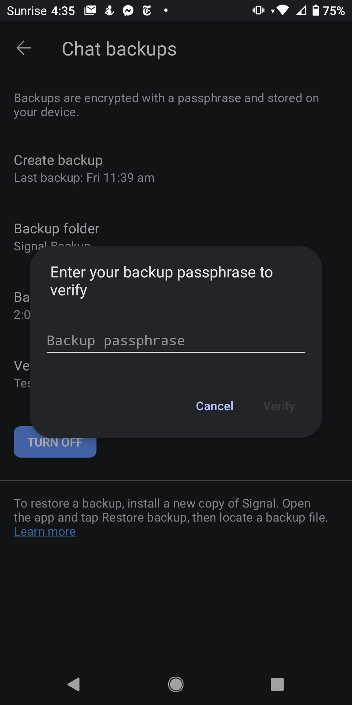  | 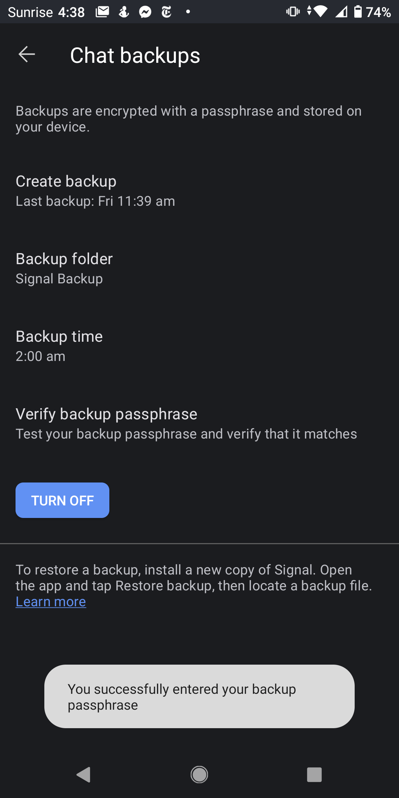  | 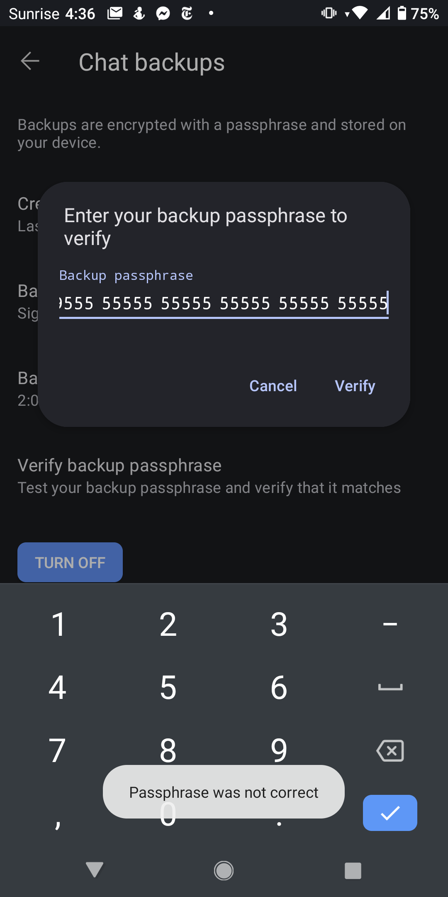   |

Once you are certain that you have a working backup and passphrase, download the application and install it as described in the [Android Download](#android-download) section.

#### **Transfer your Signal Data**
Once you have successfully installed the APK you will need to load the data out of your backup into the modified application and reregister your mobile phone number with your account (and maybe your Signal PIN if you had registration lock enabled).
When opening the modified application for the first time, give it the permissions it needs to function like you did when installing the unmodified Signal application, and navigate to "Transfer or restore account".

|  |  |  |  |
| ------------- | ------------- | ------------- | ------------- |
| 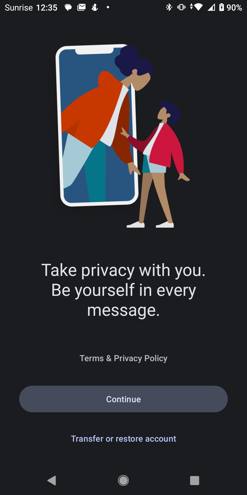  | 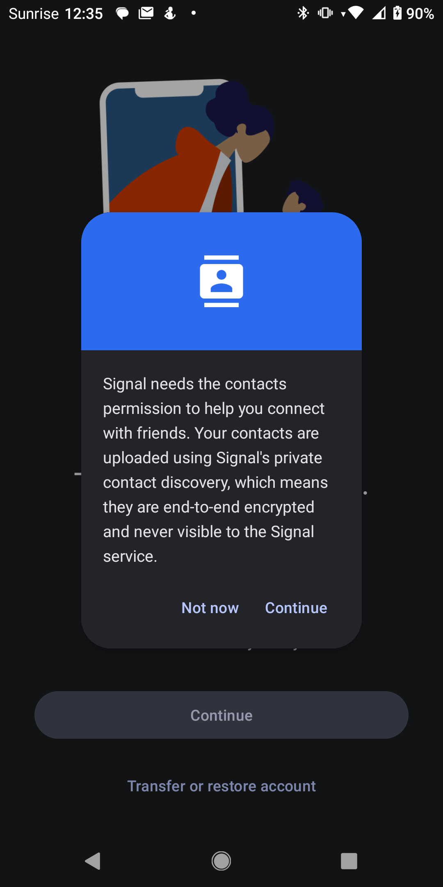  | 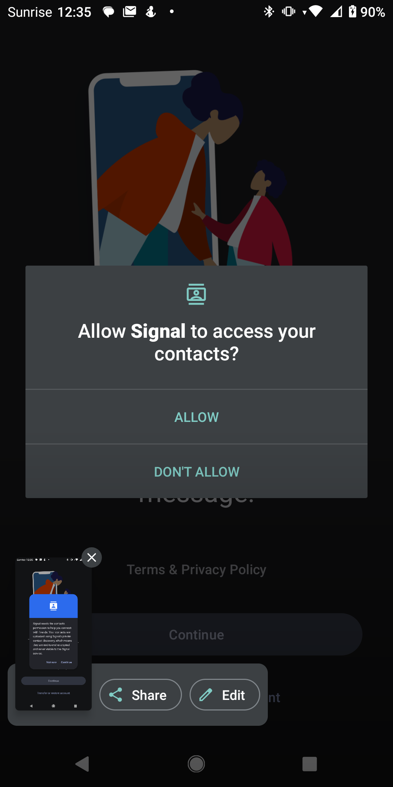  | 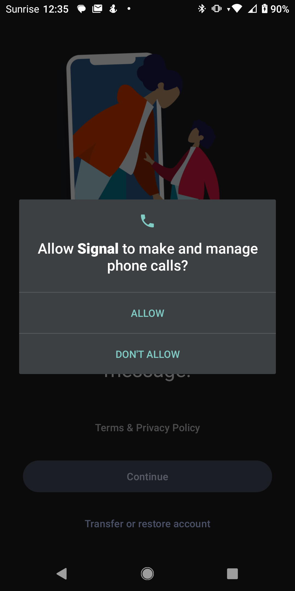   |

From there pick "Restore from backup", choose the backup file tap "Restore backup" and input your passphrase. If you have the correct passphrase, a progress indicator will appear. If you make a mistake the application will tell you and you can try again.

|  |  |  |  |
| ------------- | ------------- | ------------- | ------------- |
| 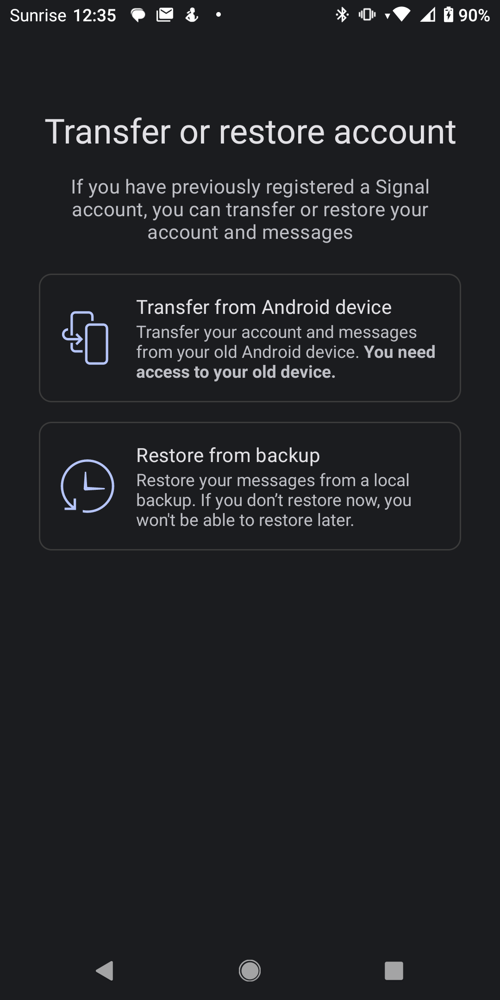  | 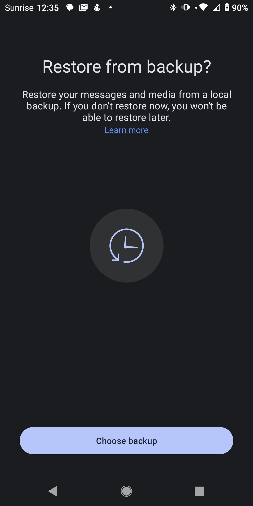  | 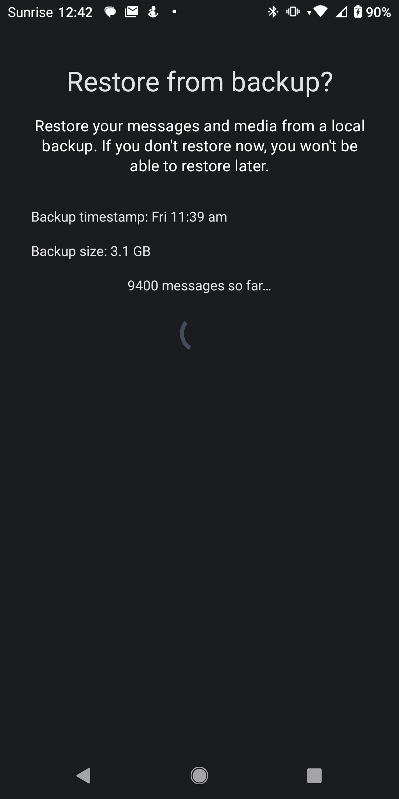  | 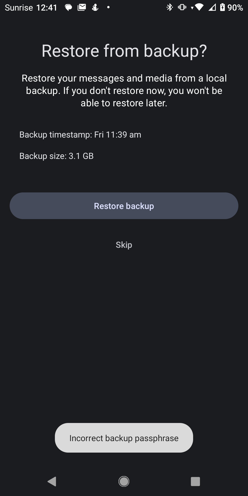   |

After your data is loaded, you may set a folder to store backups in. It does not matter if you do this now or leave it for later when you want to transfer back to a normal installation of Signal. Afterwards, you will need to reregister with your phone number as you did when you first installed the Signal application. This is where you will need your PIN if you had registration lock enabled. Be careful here, as inputting your PIN wrong too many times will temporarily lock you out of your account.

|  |  |
| ------------- | ------------- |
|   | 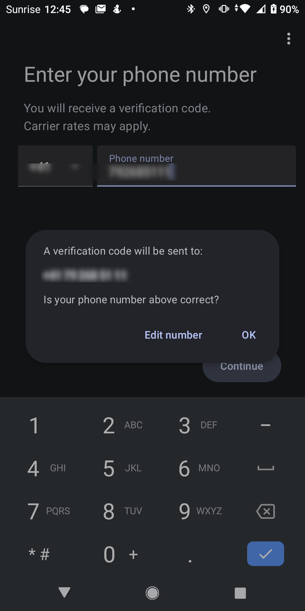  |

##### **Relink your connected devices**

 If you used the Signal desktop client, you will notice that it is no longer linked to your account after restoring the backup. In order to relink your device, you will need close the desktop application and reopen for a relink banner to appear. **Note: it may take some time after you loaded your backup into your mobile and more than one restart of the desktop application for this banner to appear.**

 |  |  |
| ------------- | ------------- |
| 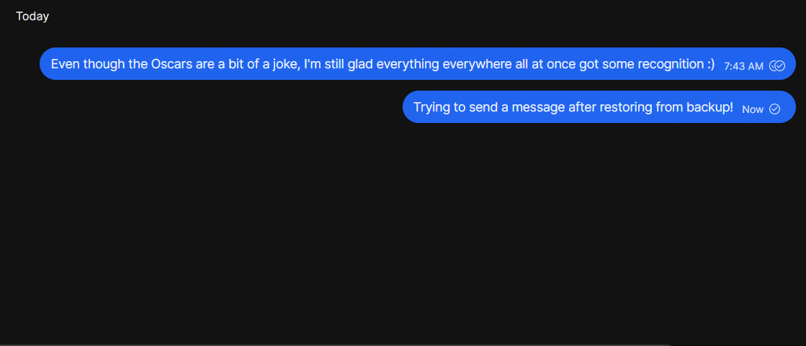  | 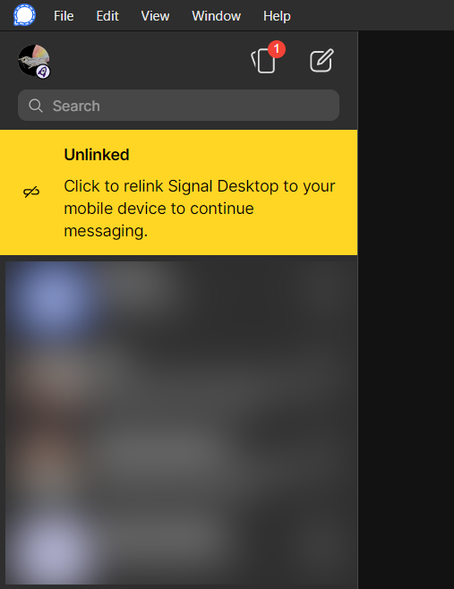  |

In your smartphone, navigate to the "settings" and "Linked devices" and tap the + icon to scan the code on your desktop and link the devices again. 

|  |  |  |
| ------------- | ------------- | ------------- |
|   |   | 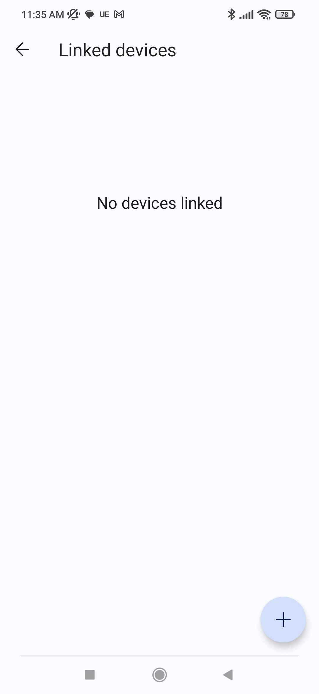  |

After scanning the code the desktop client will display a progress bar until the synchronisation is complete. 

|  |  |
| ------------- | ------------- |
| 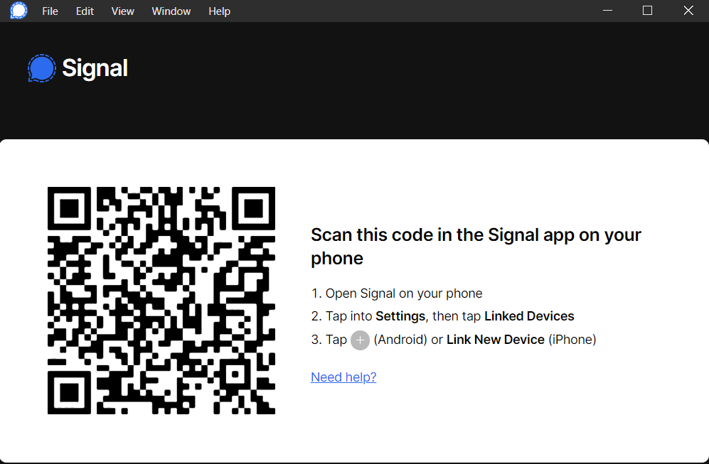  | 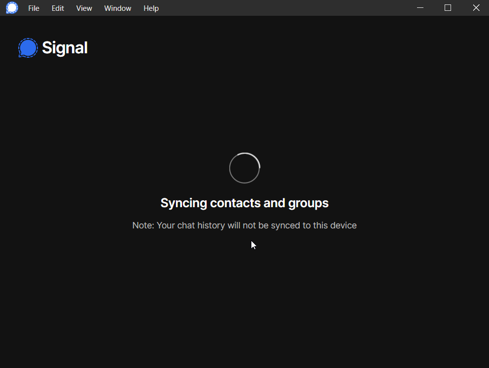 |

#### **Use Trusted Introductions**

TODO

#### **Move to a new version of the APK**

TODO:
-> also investigate why reloading a backup gets rid of some verification states? Does it have to do with secure value recovery? It downgraded for some contacts (K) but not for others (A). Alternatively I may have a bug in my logic (I rejected an introduction at some point, maybe that mistakenly went back to manually verified instead of QR verified?)

#### **Move back to a normal installation of Signal**

TODO:

### **Android Download**
You can download the newest APK for Android smartphones [here](https://polybox.ethz.ch/index.php/s/K9mgiDihWqj9dIC) . Your smartphone will warn you that the file may be harmful. This is because Android expects all applications to be downloaded via. the Google Play store. Since this is coming directly from us and not through the store, Google did not check the file for malicious code and hence you see the warning. It is safe to download the file anyway. 

#### **Which file is right for my phone?**

TODO: Note somethinbg about backups only being restorable from older versions of signal + contact if someone is stuck. 

TODO: Note that PIN must be known if it is enabled, otherwise peple can lock themselves out of the account.

TODO: If you are using Signal Desktop, you will loose your chat history on relinking the device.

##### **TLDR;**

First you must uninstall your current version of Signal, **make sure that you have backed up your chats before you do this, or you may loose all of your data irreversibly!**

You can then simply try to install the files in the following order:
1. _arm64_v8a_
2. _x86_64_
3. (if your phone is very old, _armeabi-v7a_ or _x86_)
4. if all else fails: _universal_, this should work with most phones but will use more storage

TODO: allow unknown installs

If an installation fails, your phone will simply tell you that Signal could not be installed and you can move to the next file.

|  |  |  |
| ------------- | ------------- | ------------- |
|   |   |   |

TODO: revert allow unknown installs afterwards

It is possible that none of the installers work for your device. In that case you will unfortunately not be able to participate in the study.
TODO: Could this be avoided by going through the playstore instead?

##### **More information**

The correct file will depend on the processor type that is in your smartphone. The different names denote different _instruction sets_ that a processor might use. Most commonly, Android phones use the ARM CPU architecture, more rarely, you might find an x86 architecture. 
You can google for your processor and then find which CPU cores it contains.
The more direct way is through a third party app, as this information is not commonly listed in the native Android settings. For example, [DevCheck](https://play.google.com/store/apps/details?id=flar2.devcheck) easily exposes what kind of CPUs the processor contains. 
After finding the type of CPU, you will still need to google for the instruction set.

### **Source Code**
TODO

#### **Android**
TODO

#### **Telemetry Server**
TODO
